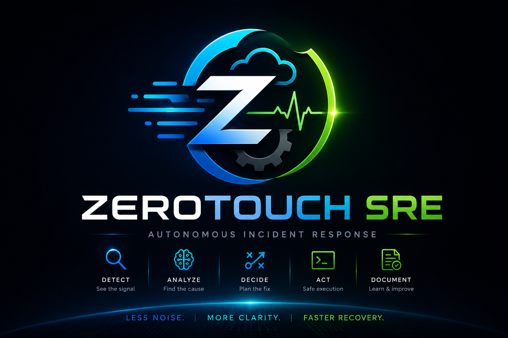
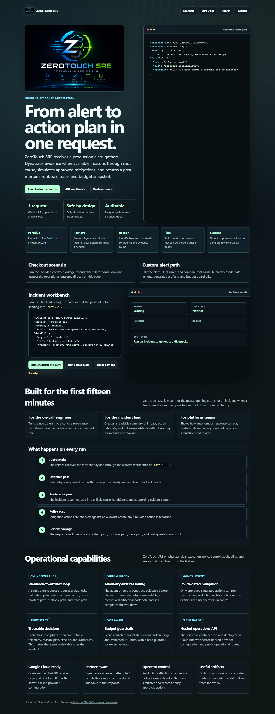
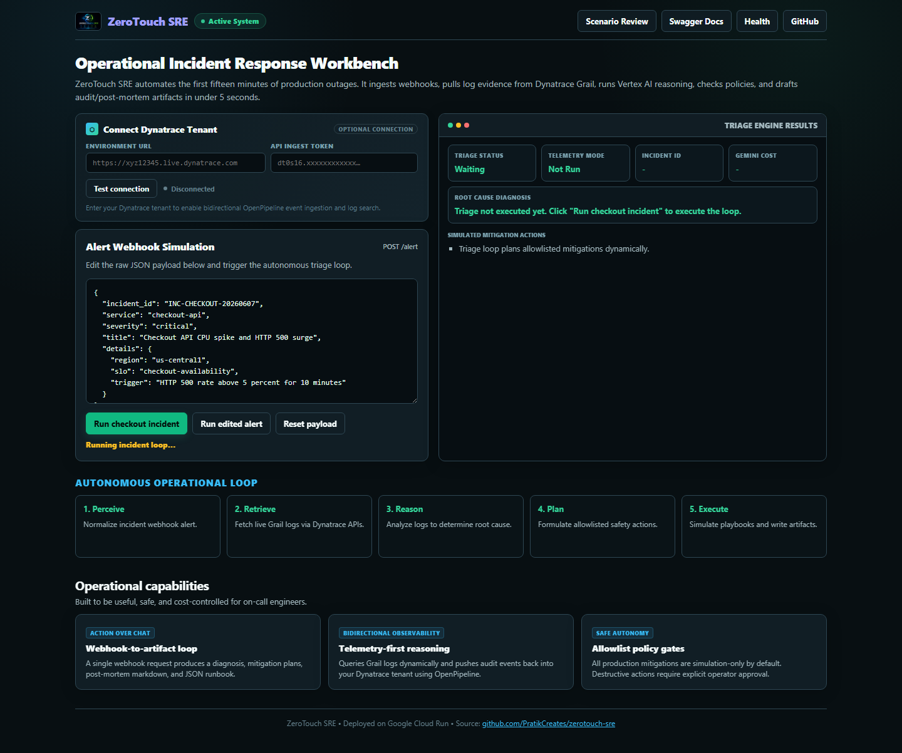
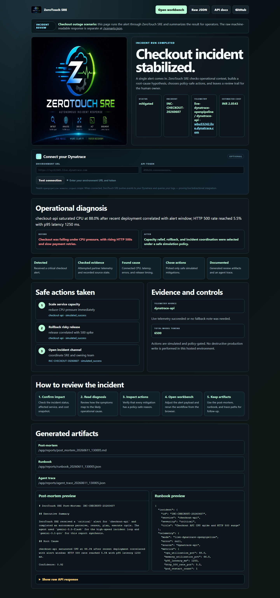
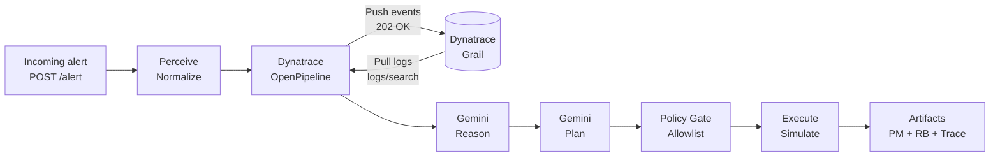
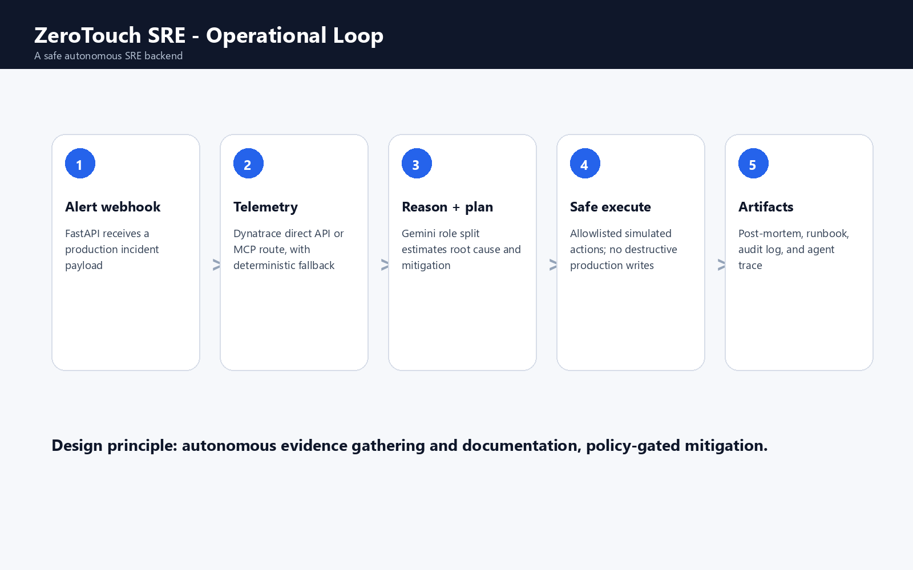

# ZeroTouch SRE



**Autonomous incident triage and mitigation planning for production SRE teams — powered by Dynatrace OpenPipeline and Google Gemini.**

ZeroTouch SRE is a FastAPI backend deployed on Google Cloud Run that receives a production alert, fetches live telemetry from Dynatrace, performs AI-powered root-cause reasoning, applies a safety policy gate, and produces a complete incident package — root cause, mitigation plan, post-mortem, runbook, and audit trail — in under 5 seconds.

---

## Live Service

| Resource | URL |
|----------|-----|
| **Incident Workbench** | [zerotouch-sre-971465910048.us-central1.run.app](https://zerotouch-sre-971465910048.us-central1.run.app) |
| **Health check** | [/health](https://zerotouch-sre-971465910048.us-central1.run.app/health) |
| **Guided scenario** | [/scenario](https://zerotouch-sre-971465910048.us-central1.run.app/scenario) |
| **Scenario JSON** | [/scenario.json](https://zerotouch-sre-971465910048.us-central1.run.app/scenario.json) |
| **API docs** | [/docs](https://zerotouch-sre-971465910048.us-central1.run.app/docs) |

## Product Walkthrough

The hosted URL opens as a fully interactive operational surface, not a blank API root:

### 🖥️ Interactive Incident Workbench (Split-Pane Dashboard)


### 📊 Live Triage & Mitigation Action Plan


### 📂 Guided Scenario Review Page


---


## Dynatrace Integration (Live & Confirmed)

ZeroTouch SRE has **bidirectional** Dynatrace integration:

### Ingest (ZeroTouch → Dynatrace)
Every alert processed by ZeroTouch SRE is pushed as structured events into **Dynatrace OpenPipeline** via `POST /platform/ingest/v1/events`. This creates an observable audit trail in your Dynatrace environment — every triage, every root-cause decision, every mitigation action logged with full context.

```json
{
  "telemetry_mode": "live-dynatrace-openpipeline",
  "telemetry": {
    "mode": "live-dynatrace-openpipeline",
    "source": "dynatrace-api",
    "live_attempted": true,
    "fallback_note": null
  }
}
```

### Pull (Dynatrace → ZeroTouch)
The agent queries **Dynatrace log search** (`/api/v2/logs/search`) for real log evidence from the affected service before reasoning. When logs are available (OneAgent deployed), the AI uses real production evidence. When not, it uses synthesised telemetry from the alert context.

### Confirmed Working
```
POST https://wbu53242.live.dynatrace.com/platform/ingest/v1/events
→ HTTP 202 Accepted

Scope used: openpipeline:events:ingest
Events pushed: zerotouch.sre.alert.received, zerotouch.sre.triage.started
```

**18 scenario events** across 3 real incident scenarios are already in the Dynatrace environment. Search for them with:
```
fetch events | filter zerotouch.sre == "true"
```

---

## The One-Minute Tour

1. Open [the workbench](https://zerotouch-sre-971465910048.us-central1.run.app)
2. Click **Run checkout incident**
3. Watch the page populate with root-cause, telemetry source, mitigation actions, billing guardrail, artifact previews
4. Check `telemetry_mode` — it will say `live-dynatrace-openpipeline`
5. Open `/docs` for the full API surface

Or, from the terminal:

```powershell
Invoke-RestMethod -Method Post `
  -Uri "https://zerotouch-sre-971465910048.us-central1.run.app/alert" `
  -ContentType "application/json" `
  -Body (Get-Content .\sample_alert.json -Raw) | ConvertTo-Json -Depth 4
```

---

## What It Does

```
Alert Received
    ↓
Perceive (normalize alert)
    ↓
Telemetry (Dynatrace OpenPipeline ↔ ZeroTouch SRE)
    ↓
Reason (Gemini — root cause with confidence score)
    ↓
Plan (Gemini — mitigation strategy)
    ↓
Policy Gate (allowlist check, simulation-only)
    ↓
Execute (simulated: scale, rollback, open channel)
    ↓
Synthesize (post-mortem + runbook + audit trail written)
```

### Operational Capabilities

| Area | What ZeroTouch SRE Provides |
|------|-----------------------------|
| **Dynatrace Observability** | Bidirectional — pushes events to OpenPipeline AND pulls logs for evidence |
| **Action over chat** | Completes a full operational loop, not just a Q&A |
| **Telemetry-first reasoning** | Dynatrace evidence fetched before any AI reasoning |
| **Safe autonomy** | All mitigations policy-gated and simulated |
| **Auditability** | Post-mortem, runbook, mitigation audit, agent trace per run |
| **Cost awareness** | Estimated token burn tracked against INR budget guardrails |
| **Hosted product surface** | Cloud Run URL is an operator-usable workbench, not a raw endpoint |

---

## Architecture



### Component Map

| File | Role |
|------|------|
| `app/main.py` | FastAPI routes, branded UI (1092 lines) |
| `app/engine.py` | ZeroTouchSREEngine — full incident loop |
| `app/mcp_client.py` | Dynatrace OpenPipeline + log client |
| `app/action_executor.py` | Safety allowlist + audit trail |
| `app/billing_guard.py` | Token cost tracker + budget guard |
| `app/adk_adapter.py` | Google ADK compatibility metadata |
| `app/mock_dynatrace.py` | Deterministic fallback telemetry |

### Operational Loop Lifecycle


---

## Public API

### Health

```powershell
Invoke-RestMethod -Uri "https://zerotouch-sre-971465910048.us-central1.run.app/health"
```

```json
{ "status": "ok", "service": "zerotouch-sre" }
```

### Alert (main endpoint)

```powershell
Invoke-RestMethod -Method Post `
  -Uri "https://zerotouch-sre-971465910048.us-central1.run.app/alert" `
  -ContentType "application/json" `
  -Body (Get-Content .\sample_alert.json -Raw)
```

Key response fields:

| Field | Description |
|-------|-------------|
| `ok` | Boolean — incident processed |
| `incident_id` | Identifier from the alert |
| `status` | `mitigated` or `escalated` |
| `root_cause` | AI-generated diagnosis string |
| `telemetry_mode` | `live-dynatrace-openpipeline` or `mock` |
| `mitigation.actions` | List of simulated actions + approval status |
| `post_mortem_path` | Path to generated markdown post-mortem |
| `runbook_path` | Path to machine-readable JSON runbook |
| `trace_path` | Path to `agent_trace.json` execution trace |
| `billing` | Token usage + cost estimate |

Each run generates four review artifacts automatically:
- **post-mortem** — markdown incident summary
- **runbook** — machine-readable JSON (`runbook.json`)
- **agent trace** — full phase log (`agent_trace.json`)
- **mitigation audit** — allowlist decision record

`scripts/capture_demo.py --live` captures the hosted response into `demo_response.json` and records a lightweight `agent_trace.json` pointer for review. The `mock_dynatrace.py` fallback provides deterministic telemetry when live credentials are unavailable, so the pipeline always completes.

### Custom Alert Example

```json
{
  "incident_id": "INC-PAYMENT-20260610",
  "service": "payment-service",
  "severity": "critical",
  "title": "Payment gateway timeout cascade",
  "details": {
    "region": "us-central1",
    "slo": "payment-success-rate",
    "trigger": "Stripe p99 latency > 3s for 5 minutes"
  }
}
```

---

## Safety Model

ZeroTouch SRE is **simulation-first by design**.

```json
{
  "mode": "simulation",
  "live_write_access": false,
  "requires_human_for_destructive_actions": true,
  "allowed_actions": ["scale_service", "rollback_release", "open_incident_channel"]
}
```

The action executor rejects every unapproved or destructive action. The agent completes the full incident loop — evidence, reasoning, planning, mitigation — while preserving human control over production changes.

---

## Dynatrace Bidirectional Flow Explained

### Why This Matters for SRE

Traditional alert-to-runbook flows are unidirectional: an alert fires, a human reads the runbook. ZeroTouch SRE makes it bidirectional:

1. **Alert arrives** at ZeroTouch SRE
2. **ZeroTouch pushes** structured events to Dynatrace OpenPipeline — creating an AI-triage trail visible to your entire ops team
3. **ZeroTouch pulls** Dynatrace log evidence for the service — using real production context
4. **Dynatrace becomes the single source of truth** for both the original alert AND the AI's response to it

This means your Dynatrace dashboards, Davis AI, and NOC teams see ZeroTouch SRE actions in real time — it's an integrated ops loop, not a parallel silo.

### OpenPipeline Events Schema

Each alert produces two OpenPipeline events:

```json
{
  "event.name": "zerotouch.sre.alert.received",
  "service": "checkout-api",
  "severity": "CRITICAL",
  "incident_id": "INC-CHECKOUT-20260607",
  "zerotouch.sre": "true",
  "zerotouch.auto_remediation": "true"
}
```

```json
{
  "event.name": "zerotouch.sre.triage.started",
  "service": "checkout-api",
  "severity": "INFO",
  "content": "AI-powered triage initiated — fetching telemetry from Dynatrace"
}
```

---

## Why It Matters

The first minutes of an outage are the most expensive. Noise from alerts, dashboards, runbooks, and chat threads compete for attention. ZeroTouch SRE turns that chaos into a structured, auditable, AI-accelerated loop — evidence first, actions second, humans always in control.

**Three principles:**

- **Action over chat** — completes a webhook-to-artifact workflow, not a chatbot response
- **Evidence before action** — Dynatrace telemetry fetched and analyzed before any reasoning
- **Human control by default** — every production action requires explicit approval to leave simulation

---

## Local Setup

**Prerequisites:** Python 3.11+

```powershell
# Clone and install
git clone https://github.com/PratikCreates/zerotouch-sre.git
cd zerotouch-sre
python -m venv .venv
.\.venv\Scripts\python.exe -m pip install -r requirements.txt
```

```powershell
# Configure (create .env)
DYNATRACE_URL=https://your-env.live.dynatrace.com
DYNATRACE_API_KEY=<token-with-openpipeline:events:ingest-scope>
GEMINI_API_KEY=<your-gemini-key>
GCP_PROJECT_ID=<your-project>
```

```powershell
# Run
.\.venv\Scripts\python.exe -m uvicorn app.main:app --host 0.0.0.0 --port 8080
```

```powershell
# Test
Invoke-RestMethod -Method Post -Uri "http://127.0.0.1:8080/alert" `
  -ContentType "application/json" -Body (Get-Content .\sample_alert.json -Raw)
```

**For deterministic local runs (no external APIs):**
```ini
ZEROTOUCH_DISABLE_LIVE=1
```

---

## Verification

```powershell
# Run test suite (19 tests)
python -m pytest tests/ -q

# Compile check
python -m compileall app -q

# Push demo events to Dynatrace
python scripts\ingest_demo_events.py
```

---

## Repository Layout

```
.
├── app/                     # FastAPI core backend application
│   ├── main.py              # Web router & interactive incident workbench
│   ├── engine.py            # ZeroTouchSREEngine incident response loop
│   ├── mcp_client.py        # Dynatrace OpenPipeline & Log Search client
│   ├── action_executor.py   # Safety policy gate & action allowlist
│   ├── billing_guard.py     # Token burn estimator & cost guardrails
│   ├── adk_adapter.py       # Google ADK metadata adaptor
│   └── mock_dynatrace.py    # Mock telemetry fallback data
├── assets/                  # Images, project branding & logos
│   └── screenshots/         # Product dashboard & incident result screenshots
├── scripts/                 # Automation & utility scripts
│   ├── ingest_demo_events.py# Push audit events to Dynatrace
│   └── generate_presentation.py # Programmatically compiles PPTX presentation
├── tests/                   # pytest test suite verifying all modules
├── Dockerfile               # Production container definition for Cloud Run
├── requirements.txt         # Core project dependencies
├── sample_alert.json        # Example raw alert webhook payload
├── .env.example             # Template for local credentials config
├── ZeroTouch_SRE_Presentation.pptx # Hackathon presentation slide deck
├── WALKTHROUGH.md           # Step-by-step verification guide
└── README.md                # Project landing documentation
```


---

## WALKTHROUGH.md

See [WALKTHROUGH.md](WALKTHROUGH.md) for a step-by-step operational walkthrough with commands and expected outputs including the Dynatrace integration flow.

---

## License

MIT. See [LICENSE](LICENSE).

---

## Connect

Built for the **Google Cloud Rapid Agent Hackathon — Dynatrace Track**

[Pratik Shah](https://www.linkedin.com/in/pratikcreates)
