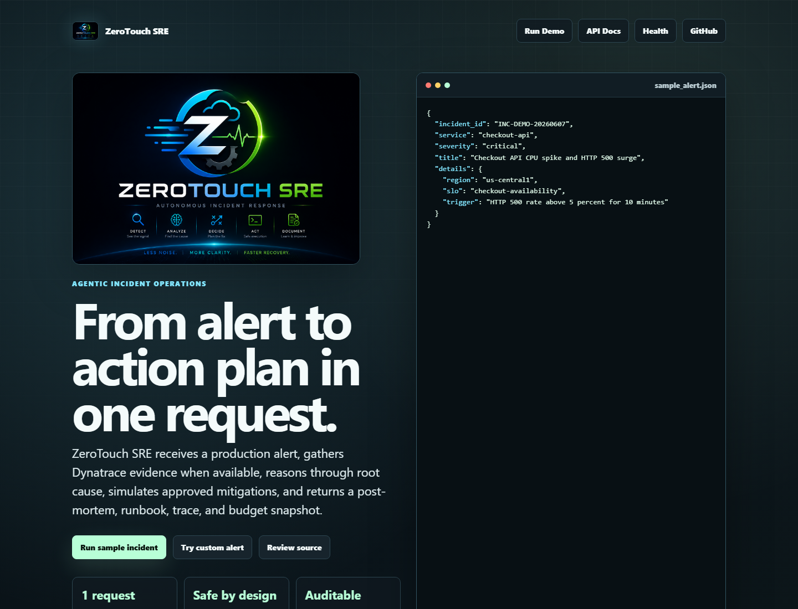
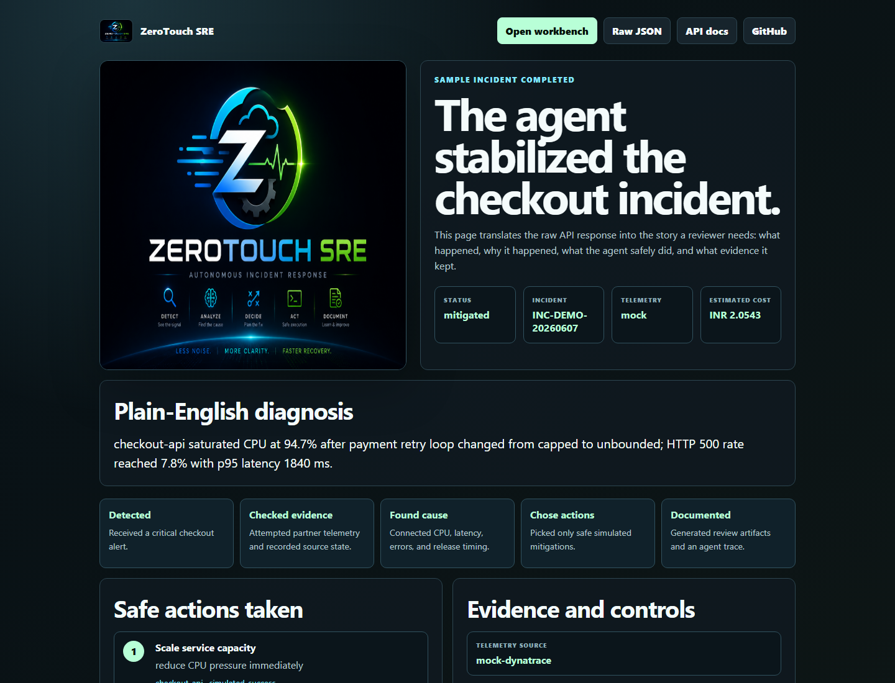
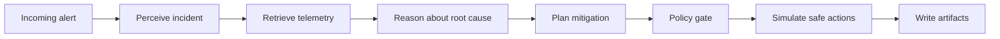

# ZeroTouch SRE


Autonomous incident triage and mitigation planning for production SRE teams.

ZeroTouch SRE is a FastAPI backend that receives a production alert, gathers telemetry, identifies a likely root cause, runs proposed actions through a safe simulation policy, and produces incident artifacts for review. It is designed for teams that want agentic operations without giving an unreviewed agent destructive production access.

## Start Here

The hosted project is the best first stop:

[https://zerotouch-sre-971465910048.us-central1.run.app](https://zerotouch-sre-971465910048.us-central1.run.app)

It opens a full interactive website with an editable incident workbench. Click **Run sample incident** to execute the backend from the page, then review the rendered root cause, telemetry mode, mitigation actions, cost guardrail, and raw JSON.


## Live Demo

- Hosted backend: [https://zerotouch-sre-971465910048.us-central1.run.app](https://zerotouch-sre-971465910048.us-central1.run.app)
- Health check: [https://zerotouch-sre-971465910048.us-central1.run.app/health](https://zerotouch-sre-971465910048.us-central1.run.app/health)
- Browser demo: [https://zerotouch-sre-971465910048.us-central1.run.app/demo](https://zerotouch-sre-971465910048.us-central1.run.app/demo)
- Raw demo JSON: [https://zerotouch-sre-971465910048.us-central1.run.app/demo.json](https://zerotouch-sre-971465910048.us-central1.run.app/demo.json)
- Interactive API docs: [https://zerotouch-sre-971465910048.us-central1.run.app/docs](https://zerotouch-sre-971465910048.us-central1.run.app/docs)

Start with the hosted backend URL. It opens an interactive website with an editable incident workbench, key innovation cards, and direct links to the API docs and source.

## Visual Walkthrough

The hosted URL opens as a product surface, not a blank API root.



The visual demo translates the raw agent response into a non-technical incident story.



## The One-Minute Tour

1. Open the hosted project URL.
2. Click **Run sample incident** in the embedded workbench.
3. Watch the page populate with:
   - incident status
   - telemetry source and mode
   - root-cause diagnosis
   - simulated mitigation actions
   - billing guardrail snapshot
   - raw response JSON
4. Edit the alert payload and click **Run edited alert** to prove the backend is live.
5. Open `/docs` for a branded Swagger UI with examples and response schemas.

## What It Does

1. Accepts an incident alert at `POST /alert`.
2. Normalizes the alert into an incident record.
3. Attempts live Dynatrace telemetry through deployed credentials.
4. Falls back to deterministic telemetry if live evidence is unavailable.
5. Produces root-cause reasoning and a mitigation plan.
6. Executes only allowlisted simulated mitigation actions.
7. Returns paths for a post-mortem, machine-readable runbook, and agent trace.
8. Tracks estimated token burn against configured budget guardrails.


## Key Innovations

| Area | What ZeroTouch SRE Shows |
| --- | --- |
| Action over chat | The agent runs a complete operational loop instead of only answering a question. |
| Telemetry-first reasoning | Dynatrace evidence is attempted before root-cause reasoning and mitigation planning. |
| Safe autonomy | Mitigations are policy-gated and simulated; destructive writes are blocked. |
| Auditability | Each run produces a post-mortem, runbook, mitigation audit trail, and agent trace. |
| Cost awareness | Simulated model usage is tracked against INR budget guardrails. |
| Hosted testing | The Cloud Run URL is a usable product surface, not just a raw API endpoint. |

## Why It Matters

The first minutes of an outage are noisy: alerts, dashboards, runbooks, chat threads, and incomplete context all compete for attention. ZeroTouch SRE turns that early incident window into a structured operational loop. It gives small teams a consistent first pass at triage, a safe mitigation proposal, and reusable documentation without pretending that production control should be handed away blindly.

The project is built around three practical principles:

- **Action over chat**: the service completes a webhook-to-artifact workflow instead of only answering a question.
- **Evidence before action**: telemetry is gathered before root-cause reasoning and mitigation planning.
- **Human control by default**: production-affecting actions are simulated and allowlisted.

## Architecture


The backend follows a controlled incident loop:

- **Webhook**: `app/main.py` exposes `/health` and `/alert`.
- **Telemetry**: `app/mcp_client.py` attempts Dynatrace evidence and falls back deterministically.
- **Reasoning**: `app/engine.py` performs the perceive, reason, plan, execute, synthesize flow.
- **Safety**: `app/action_executor.py` enforces an allowlist and writes an audit trail.
- **Budgeting**: `app/billing_guard.py` estimates usage and blocks excessive burn.
- **Runtime metadata**: `app/adk_adapter.py` records Google ADK availability and model-role metadata.

## Agent Loop



The agent attempts live provider evidence first. If live telemetry is unavailable, the deterministic Dynatrace-style fallback keeps the workflow testable while making fallback mode visible in the response.

## Public API

### Website

Open:

```text
https://zerotouch-sre-971465910048.us-central1.run.app/
```

Use the embedded workbench to run or edit an incident without leaving the page.

### Health

```powershell
Invoke-RestMethod `
  -Method Get `
  -Uri "https://zerotouch-sre-971465910048.us-central1.run.app/health"
```

Example response:

```json
{
  "status": "ok",
  "service": "zerotouch-sre"
}
```

### Browser Demo

Open:

```text
https://zerotouch-sre-971465910048.us-central1.run.app/demo
```

This runs the included checkout incident through the same engine used by `POST /alert`, then renders the result as a plain-English visual walkthrough.

For raw JSON output:

```text
https://zerotouch-sre-971465910048.us-central1.run.app/demo.json
```

### Interactive Docs

Open:

```text
https://zerotouch-sre-971465910048.us-central1.run.app/docs
```

Use `GET /demo.json` for the fastest raw response, or use the Swagger UI `POST /alert` form with the sample payload from [sample_alert.json](sample_alert.json).

### Alert

```powershell
Invoke-RestMethod `
  -Method Post `
  -Uri "https://zerotouch-sre-971465910048.us-central1.run.app/alert" `
  -ContentType "application/json" `
  -Body (Get-Content .\sample_alert.json -Raw)
```

Key response fields:

- `ok`
- `incident_id`
- `status`
- `root_cause`
- `mitigation`
- `telemetry_mode`
- `telemetry`
- `post_mortem_path`
- `runbook_path`
- `trace_path`
- `billing`

Example custom alert:

```json
{
  "incident_id": "INC-WORLD-CUP-PAYMENTS",
  "service": "ticketing-payments",
  "severity": "high",
  "title": "Payment failures during ticket sale surge",
  "details": {
    "region": "northamerica-northeast1",
    "slo": "successful-payment-rate",
    "trigger": "Payment authorization failures above 4 percent",
    "business_event": "high-demand public ticket window"
  }
}
```

## Safety Model

ZeroTouch SRE is intentionally simulation-first.

Allowed actions:

- `scale_service`
- `rollback_release`
- `open_incident_channel`

The action executor rejects unapproved or destructive actions. This keeps the agent useful during incident triage while preserving human control over production changes.

## Artifact Outputs

Each successful run writes review artifacts inside the running service environment:

- post-mortem markdown
- machine-readable runbook JSON
- agent trace JSON
- mitigation audit log

The public API returns paths to those artifacts. The hosted page also shows the raw response so the generated outputs are easy to inspect during a demo.

## Design Notes

The project is intentionally machine-to-machine at the backend layer, but the hosted root URL is a real product surface for judging and testing. It gives reviewers a fast way to understand the workflow, run the sample incident, edit the payload, and see the response without needing local setup.

The UI emphasizes:

- a clear first action
- readable incident payload
- visible agent phases
- direct innovation callouts
- safe-action language
- API docs as a secondary path

## Local Setup

Prerequisites:

- Python 3.11+
- `pip`

Install dependencies:

```powershell
python -m venv .venv
.\.venv\Scripts\python.exe -m pip install -r requirements.txt
```

Run locally:

```powershell
.\.venv\Scripts\python.exe -m uvicorn app.main:app --host 0.0.0.0 --port 8080
```

Send a local alert:

```powershell
Invoke-RestMethod `
  -Method Post `
  -Uri "http://127.0.0.1:8080/alert" `
  -ContentType "application/json" `
  -Body (Get-Content .\sample_alert.json -Raw)
```

## Configuration

Runtime configuration is read from environment variables:

```ini
DYNATRACE_URL=https://example.live.dynatrace.com
DYNATRACE_API_KEY=<dynatrace-api-token>
GEMINI_API_KEY=<gemini-api-key>
GCP_PROJECT_ID=<google-cloud-project-id>
GCP_TOTAL_CREDIT_BUDGET_INR=25000
GCP_MAX_MONTHLY_BURN_LIMIT_INR=900
```

For deterministic local runs:

```ini
ZEROTOUCH_DISABLE_LIVE=1
```

Never commit `.env` files. The deployed Cloud Run service uses Secret Manager for provider keys.

## Verification

```powershell
python -m compileall app -q
```

Current package status:

- FastAPI backend implemented.
- Cloud Run deployment verified.
- `/health` and `/alert` smoke-tested.
- Secret-backed provider keys configured in Cloud Run.
- Local verification completed successfully.

## Repository Layout

```text
.
|-- app/
|   |-- action_executor.py
|   |-- adk_adapter.py
|   |-- billing_guard.py
|   |-- engine.py
|   |-- main.py
|   |-- mcp_client.py
|   `-- mock_dynatrace.py
|-- assets/
|   `-- screenshots/
|-- Dockerfile
|-- LICENSE
|-- README.md
|-- WALKTHROUGH.md
|-- requirements.txt
`-- sample_alert.json
```

## Walkthrough

See [WALKTHROUGH.md](WALKTHROUGH.md) for a step-by-step operational walkthrough with commands and expected outputs.

## License

MIT. See [LICENSE](LICENSE).

## Connect

[Pratik Shah](https://www.linkedin.com/in/pratikcreates)
